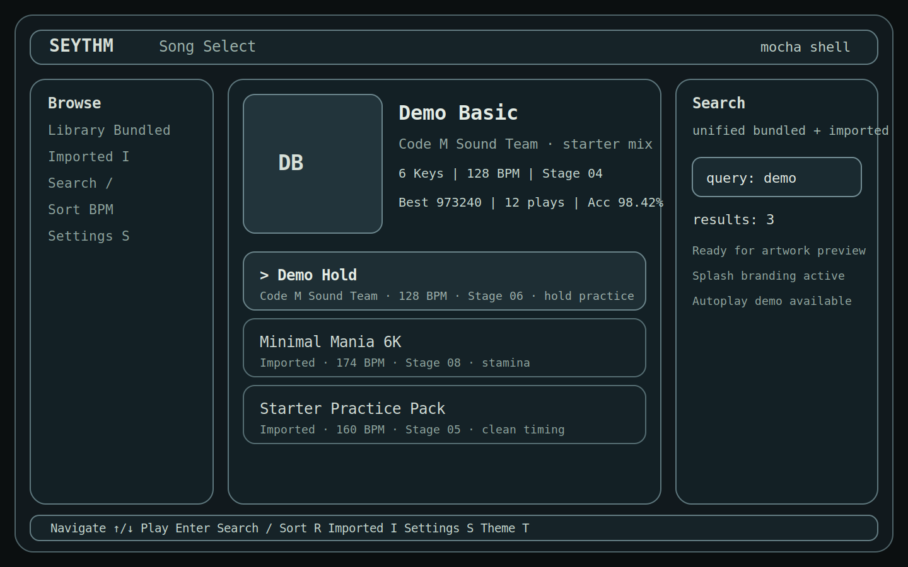
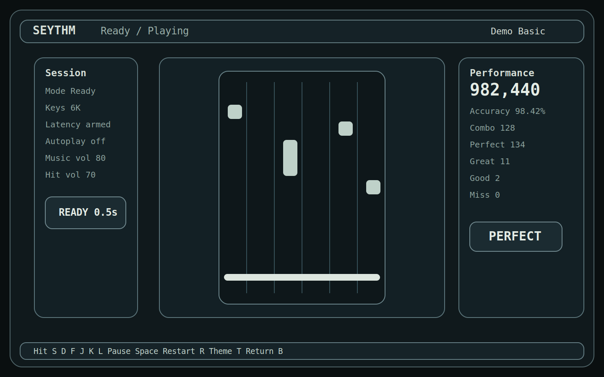
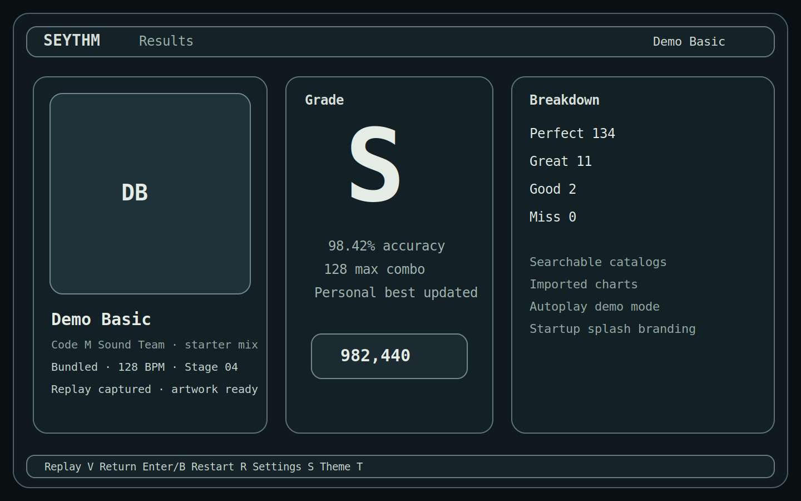

# Seythm

[](https://github.com/Asanilo/seythm/releases)
[](./LICENSE)
[](./RELEASING.md)
[](./README.md#platform-notes)

Seythm is a terminal-native 6-key rhythm game with a shell-first interface, bundled charts, osu!mania import, unified search, startup branding, artwork preview, and an autoplay demo mode for capture and showcase flows.

## Highlights

- Unified chart search across bundled and imported songs
- `autoplay` demo mode for clean recording and showcase loops
- Startup splash and product-side ASCII branding
- Loading and ready flow that protects opening notes from being dropped
- Terminal image preview when the terminal supports kitty-style graphics

## Screenshots







## Quick Start

Run from source:

```bash
cargo run
```

Run autoplay demo mode:

```bash
cargo run -- autoplay
```

Import an extracted osu!mania folder:

```bash
cargo run -- --import-osu /path/to/extracted/beatmap-folder
```

Release binary path:

```bash
./target/release/seythm
```

## Controls

- `Enter`: start song / confirm
- `↑/↓`: move selection
- `/`: open unified search
- `R`: cycle browse sort
- `I`: switch to imported charts
- `S`: open settings
- `T`: cycle theme
- `Esc`: back / close search / quit from browse

## Release Downloads

The current public alpha release is available on the GitHub Releases page:

- [Releases](https://github.com/Asanilo/seythm/releases)

Each release archive includes:

- `seythm` executable
- `assets/`
- `README.md`
- `LICENSE`

## Platform Notes

Current status:

- Linux: primary tested target and the current release package
- macOS: expected to be workable, but still needs real terminal and audio validation
- Windows: expected to build, but still needs validation for terminal behavior and image fallback

Artwork preview gracefully falls back to text-only mode in terminals without graphics support. For the best experience, use `kitty` or `ghostty`.

Cross-platform release notes and packaging guidance live in [`RELEASING.md`](./RELEASING.md).

## Repository Layout

Public source contents:

- `src/`
- `assets/`
- `tests/`
- `Cargo.toml`
- `Cargo.lock`
- `README.md`
- `RELEASING.md`
- `LICENSE`

Do not publish build artifacts such as `target/`.

## Branding

Branding is product-side, not user-editable in settings. The product name, tagline, startup hint, and ASCII logo come from:

- `assets/brand.toml`
